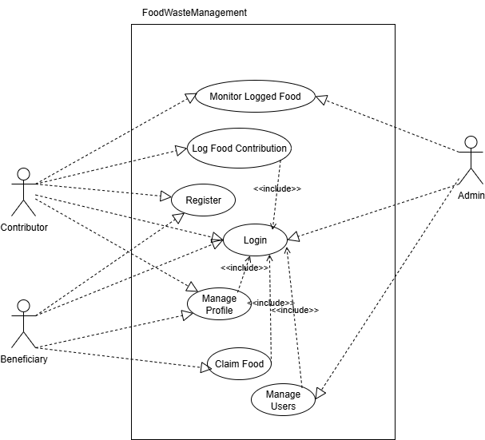
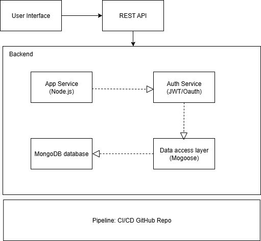
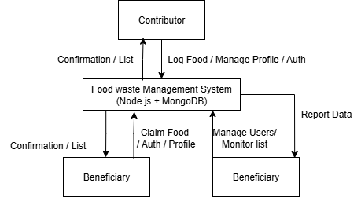
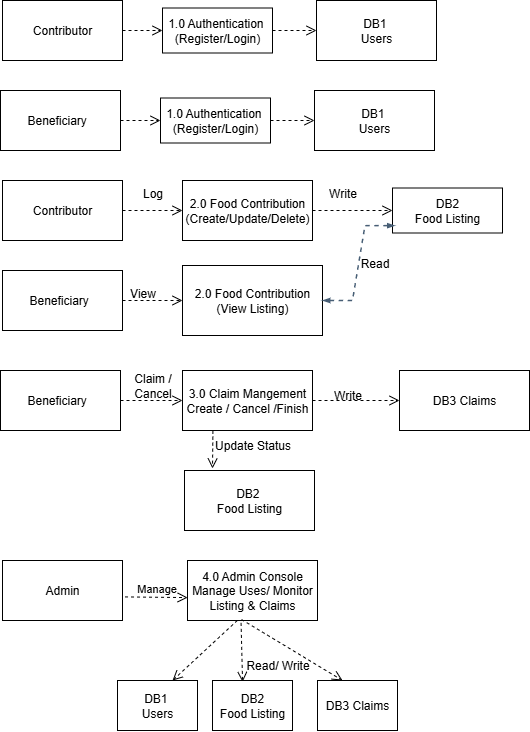

# Software Requirements Specification (SRS)
**Project:** Food Waste Management Platform (FWMP)  
**Prepared for:** IFN636 Assessment 2  

---

## 2. SRS Documentation  

### 2.1 Purpose  
The purpose of the Food Waste Management Platform (FWMP) is to reduce food waste by connecting contributors (households, restaurants, supermarkets) with beneficiaries (charities, NGOs, or individuals in need). The platform allows contributors to log surplus food and beneficiaries to claim contributions efficiently.  

---

### 2.2 Problem Statement  
Food waste is a global challenge, with large volumes of edible food discarded due to the absence of structured redistribution systems. Current donation practices are fragmented and inefficient. This leads to missed opportunities to feed communities in need. FWMP provides a centralized, transparent, and accessible digital solution to enable food redistribution.  

---

### 2.3 Scope  

- **In-Scope Features:**  
  - Secure user authentication (Register, Login).  
  - User roles: Contributor, Beneficiary, Admin.  
  - Food contribution management (log, update, delete).  
  - Dashboard displaying available food contributions.  
  - Claiming food items by beneficiaries.  
  - User profile management.  
  - Admin monitoring and user management.  

- **Out-of-Scope Features:**  
  - Payment systems.  
  - Third-party logistics/delivery.  
  - Notification services.  

---

### 2.4 User Characteristics  

- **Contributors**: households, restaurants, supermarkets. Likely to have basic to moderate computer literacy.  
- **Beneficiaries**: charities, NGOs, individuals. Require simple web access and low learning curve.  
- **Admins**: platform supervisors with higher technical proficiency.  

Users will primarily access the system through web browsers (desktop and mobile).  

---

### 2.5 Constraints  

- **Technical:** Built using Node.js/Express with MongoDB as the only database.  
- **Deployment:** Cloud-based deployment with CI/CD from GitHub.  
- **Authentication:** JWT for session management.  
- **Limitations:** No push/email notifications implemented.  
- **Compliance:** Must secure user data and include food safety disclaimers.  

---

### 2.6 Functional Requirements  

1. **User Authentication**  
   - Register with name, email, password, address, and role.  
   - Log in securely with JWT-based session handling.  

2. **Dashboard**  
   - Display available food contributions as cards.  
   - Filter contributions by category or location.  

3. **Food Contribution Management**  
   - Contributors can create, update, and delete food items.  
   - Beneficiaries can view and claim items.  

4. **User Profile Management**  
   - Update name, email, address, and role.  

5. **Admin Functions**  
   - Monitor user activities and food contributions.  
   - Manage users (approve, suspend, or delete accounts).  

---

### 2.7 Non-Functional Requirements (NFRs)  

- **Performance:** Support 500+ concurrent users.  
- **Security:** Password hashing, encrypted communication (TLS 1.3).  
- **Reliability:** 99% uptime.  
- **Usability:** Intuitive UI with minimal training required.  
- **Maintainability:** Modular architecture, use of design patterns.  
- **Scalability:** Cloud-ready, horizontal scaling supported.  
- **Accessibility:** WCAG 2.1 compliance.  

---

### 2.8 User Interface Mockups / Wireframes (Low Fidelity)  

From Figma prototype:  
- Login page  
- Registration page  
- Dashboard (contributions list)  
- Food contribution form  
- User profile page  

[Link to Figma Wireframes](https://www.figma.com/design/4igSbs1J3N2pNaDe6gTHLD/IFN636A2?node-id=0-1&t=IPoijwJdJ0kqSnAP-1)  

---

### 2.9 Complete System Diagram  

- **Use Case Diagram:** showing Contributor, Beneficiary, and Admin with system boundary.  
- **System Architecture Diagram:** React frontend → Node.js/Express backend → MongoDB database → CI/CD pipeline.  
- **Data Flow Diagram (DFD):**  
  - *Level 0:* External actors interacting with FWMP system.  
  - *Level 1:* Authentication, Food Contributions, Claims, Admin Console, linked to MongoDB collections.  

#### Use Case Diagram  

#### System Architecture Diagram  
  
#### Data Flow Diagram (Level 0)  
  

#### Data Flow Diagram (Level 1)  
  
---

### 2.10 Safety Considerations  

- Display food safety and liability disclaimers.  
- Prevent expired or unsafe food listings (auto-expiry of items).  
- Secure user authentication to prevent unauthorized access.  
- Prevent multiple claims of the same item (concurrency checks).  

---

### 2.11 Risk Management  

| Risk | Impact | Likelihood | Mitigation |
|------|--------|------------|------------|
| Fake accounts | High | Medium | User verification and admin moderation |
| Data breaches | Critical | Medium | Enforce encryption, role-based access |
| Food safety concerns | High | High | Disclaimers, automatic expiry of items |
| System downtime | Medium | Medium | Automated backups, cloud monitoring |
| Scope creep | Medium | Medium | Stick to assessment-defined features |

---
